# Motivation for SkyChain

I _hate_ jupyter notebook.
For a few reasons, but primarily because it is a very clever product that doesn't actually doing anything clever.

That's a fairly presumptious statement, so let me clarify.

Importantly, a kernel is essentially a fancy [REPL](https://en.wikipedia.org/wiki/Read%E2%80%93eval%E2%80%93print_loop) tool.
Instead of typing single lines of code, the notebook makes it possible to define a block (cell) of code, that is feed into the interpreter as one chunk.

This is an incredibly valuable way of interacting with code.
Rapid iteration, slight parameter modification, and easy visualization are charateristics of research code that a REPL tool readily provides, and when paired with a way to easily run a code-chunk instead of a single line, it is quite obvious why Jupyter Notebook is as ubiquitous as it is.

REPL tools however do not lend themselves well to _sustainable_ code.
It inherently generates global state, redefines identifiers, and a myriad of issues anyone who has regularly used notebook will tell you about.

These problems are inherent to the REPL / Kernel style of code execution, and truthfully, you cannot really get a way from them.

The more interesting problems are the ones born directly from Notebook itself.

A notebook is a 'dumb' piece of software.
It provides no computational capability beyond rendering and feeding a code-chunk into the provided kernel.

Taking a look at the following [notebook](docs/motivation/example.ipynb):

---
---

__Hello, World!__

This is a (representative, not actual) Jupyter Notebook!

---
Cell A
```python
demo_string = "Hello World!"
```

---
Cell B
```python
print(demo_string)
```

---
Cell C
```python
demo_string = "Goodbye World!"
```

---
---

> [!NOTE]
> As of versions:
>
> * IPython          : 8.11.0
> * ipykernel        : 6.21.3
> * jupyter_client   : 8.0.3
> * jupyter_core     : 5.2.0
> * jupyter_server   : 2.4.0
> * nbclient         : 0.7.2
> * nbconvert        : 7.2.9
> * nbformat         : 5.7.3
> * notebook         : 6.5.3
> * traitlets        : 5.9.0

If we execute the cells in the following order:

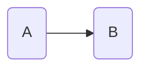

The output is

```text
Hello World!
```

Alternatively, we can execute

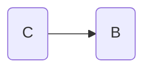

```text
Goodbye World!
```

but if we try execute


```text
---------------------------------------------------------------------------
NameError                                 Traceback (most recent call last)
Cell In[1], line 1
----> 1 print(demo_string)

NameError: name 'demo_string' is not defined
```

> [!IMPORTANT]
> Make sure to restart the kernel between executions.
>
> If you don't restart the kernel, `demo_string` may still be defined internally and provide different results.

From this example we can see a non-linear execution behaviour in the notebook, and a dependecy requirement between cells.

The dependency requirement is quite simple.
The variable `demo_string` is not defined in cell B, so if it is run before either A or C, the kernel will throw an undefined error.
Therefore B is dependent on either A or C.

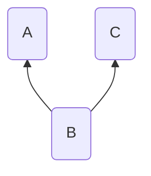

The non-linear execution is the fact that cell C is defined _after_ cell B, and yet it can still be executed before B.
In a traditional program, it must be defined linearly (C before B) before it can be executed.
This is not a hard rule, as most modern software typically resolves the non-linearity through mechanisms like [hoisting](https://developer.mozilla.org/en-US/docs/Glossary/Hoisting), distinguishing between [declaration and definition](https://stackoverflow.com/questions/1410563/what-is-the-difference-between-a-definition-and-a-declaration), or as part of the compilation process with static analysis.

However, the notebook python kernel bypasses this step by having you, the programmer, manually resolve this non-linearity.
You can just run C before you run B.
This non-linear execution is actually a virtual linear execution inside the kernel.
As far as the python interpreter is concerned, it observed the following lines of code,

```python
demo_string = "Goodbye World!"
print(demo_string)
```

even if it is visually observed as

```python
print(demo_string)
demo_string = "Goodbye World!"
```

We can also construct a global state modification with this notebook.
Execute

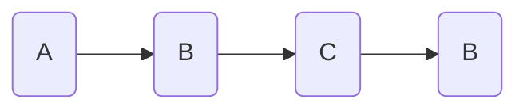

And the result is _just_

```text
Goodbye World!
```

because re-running B will overwrite the previous output.

If this was a standard python program or even just the normal python REPL tool, the output would be

```text
Hello World!
Goodbye World!
```

A notebook user might argue that you should duplicate cell B for the repeat behaviour, or if B had really complex behaviour and not just a print statement, define a function that is executed first and then called by the (still duplicated so as to not overwrite the output) B cell.

Lets tackle each of these quickly.
Duplicating B creates the following notebook dependency tree and execution graph

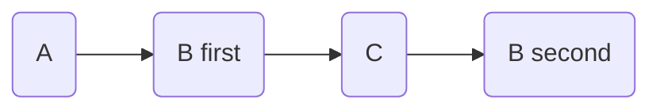

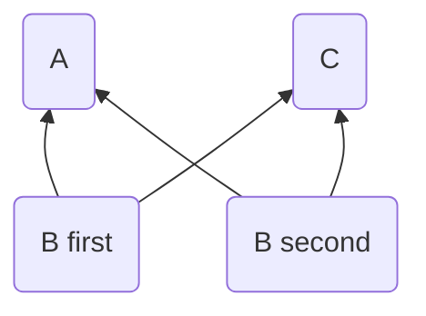

Both `B first` and `B second` depend on both `A` and `C` still, as calling C before A is a non-error (henceforth I'm refering to this as a valid execution) creating execution.

If I want to modify `B`, I now need to modify `B` twice in the _exact_ same way, or I have to remember to delete `B second` and then reduplicate `B first`.
Alarm bells should almost certainly be ringing at this point.
If `B` is always expected to have the same behaviour, you are relying on the famously fallible human brain to maintain this property.

Ok, so then you should define a function and then call it twice.
The new notebook is now

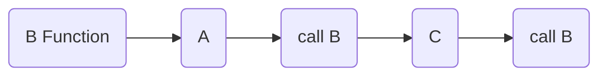

or as `A` is independent of `B Function`, the equally valid execution order

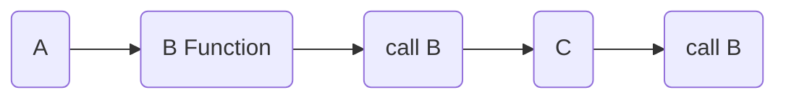

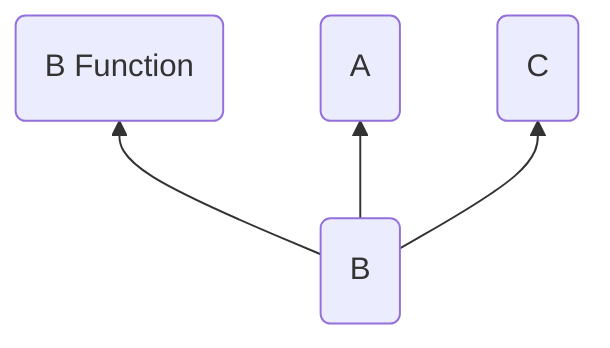


Oops, unless you've defined `B Function` with its own internal print buffer this still just outputs

```text
Goodbye World!
```

So you _still_ have to duplicate the cell calling our complex print function (or add the internal buffer but that is just asking for more trouble with global state management or carrying internal state across executions).

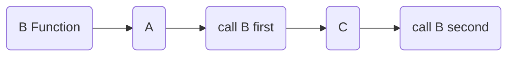

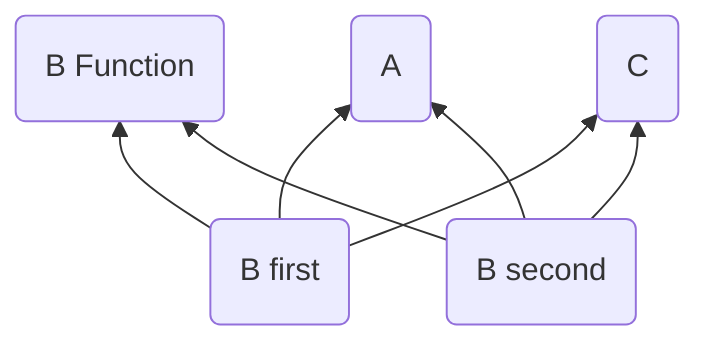

In fact the dependency graph is somewhat simplified.
`B first` and `B second` are dependent on either `A` or `C`, and always dependent on `B Function`.

__NONE__ of this information is presented to the user.
The programmer is expected to do the heavy lifting and understand how and where the dependencies occur, whether a dependency is an AND, OR, or XOR dependency, how a given cell may modify state, how execution order can overwrite the output, ...